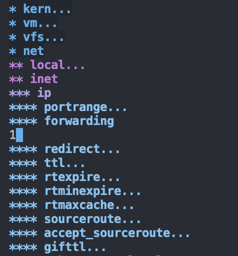

# sysctl.el

View and edit sysctl in a hierarchical structure in Emacs.
Works on Linux, ~FreeBSD~, OpenBSD, and macOS.
Will work over TRAMP via SSH as well, including multiple hops.

## Commands
`sysctl` Generate the sysctl buffer

## Keybindings
* `C-c C-c` Set the value of current position in the sysctl tree
* `C-c C-k` Refresh the value of current position in the sysctl tree
